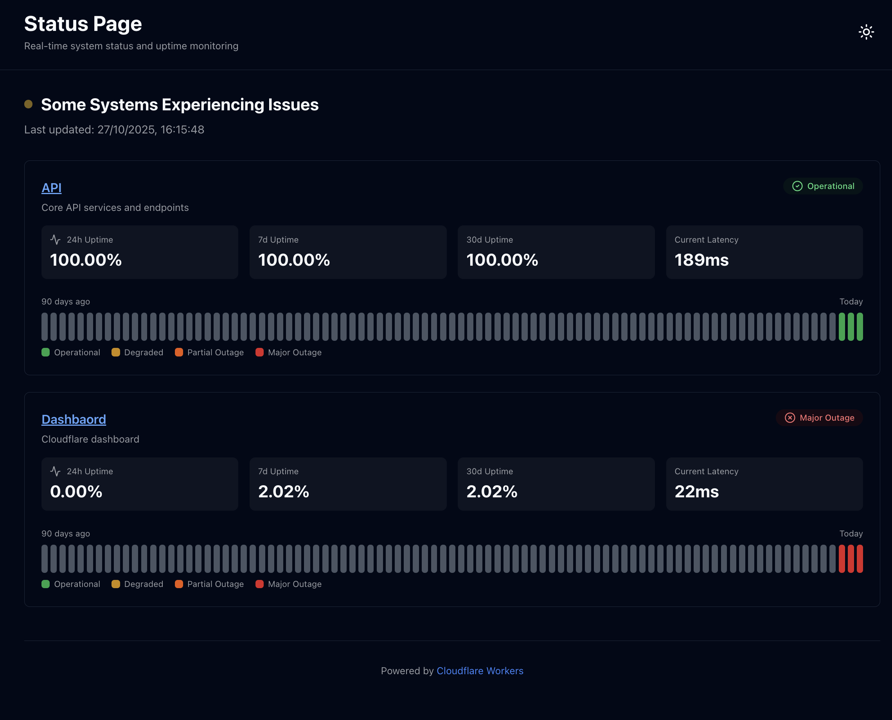

# Workers Status Page

A production-ready status page built on Cloudflare Workers with automated health monitoring and Analytics Engine integration.

[](https://deploy.workers.cloudflare.com/?url=https://github.com/walshydev/workers-status-page)



## Features

- ✅ **Automated Health Checks** - Cron-triggered monitoring every 5 minutes
- 📊 **Analytics Engine Integration** - Historical uptime and latency tracking
- 🔍 **Detailed Metrics** - 24h, 7d, and 30d uptime percentages
- 📈 **90-Day History** - Visual uptime charts

## Quick Start

### 1. Install Dependencies

```bash
$ npm install
```

### 2. Configure Services

Edit `wrangler.jsonc` to add your services:

```jsonc
{
	"vars": {
		"CONFIG": {
			"services": [
				{
					"name": "API",
					"description": "Core API services",
					"link": "https://api.example.com/",
				},
			],
		},
	},
}
```

### 3. Configure account ID and API token

Grab your account ID following the docs here: https://developers.cloudflare.com/fundamentals/account/find-account-and-zone-ids/#copy-your-account-id

Add as a secret:

```bash
$ wrangler secret put ACCOUNT_ID
```

Next, create Analytics API Token following the docs here: https://developers.cloudflare.com/analytics/graphql-api/getting-started/authentication/api-token-auth/

Then add as a secret:

```bash
$ wrangler secret put API_TOKEN
```

### 3. Deploy

```bash
$ npm run deploy
```

## Configuration

### Service Configuration

Each service in `wrangler.jsonc` supports:

```jsonc
{
	"name": "Service Name",
	"description": "Service description",
	"link": "https://service.example.com/",
	"healthcheck": {
		"url": "https://service.example.com/health", // Optional: custom health check URL
		"method": "GET", // Optional: HTTP method (default: GET)
		"timeout": 10000, // Optional: timeout in ms (default: 10000)
		"headers": {
			// Optional: object with custom headers to send
			"Authorization": "Bearer $API_TOKEN_SECRET", // You can insert secrets into headers with $<SECRET_NAME>
		},
	},
}
```

### Banner Configuration

Add a banner for maintenance notifications:

```jsonc
{
	"vars": {
		"CONFIG": {
			"banner": {
				"title": "Scheduled Maintenance",
				"description": "Services may be unavailable from 1-2 AM UTC",
			},
		},
	},
}
```

Set to `null` to hide the banner.

## Analytics Engine Setup

The Worker writes health check data to Analytics Engine and queries it for uptime metrics.

### Data Structure

- **blob1**: Service name
- **double1**: Status (1 = up, 0 = down)
- **double2**: Latency (ms)
- **double3**: HTTP status code
